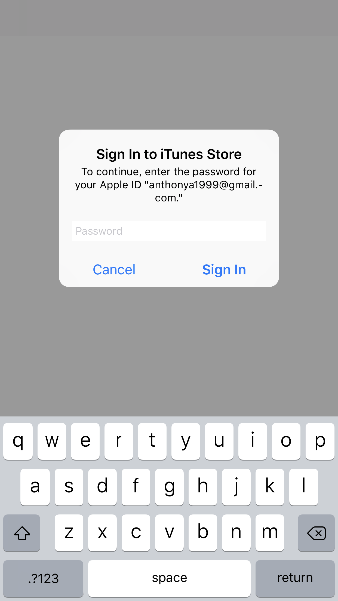
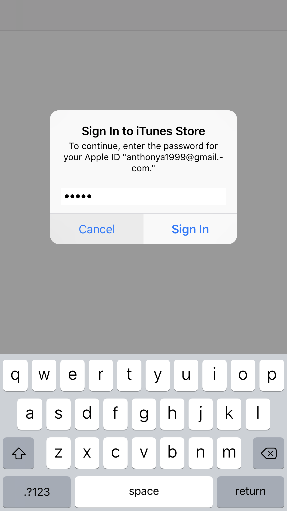
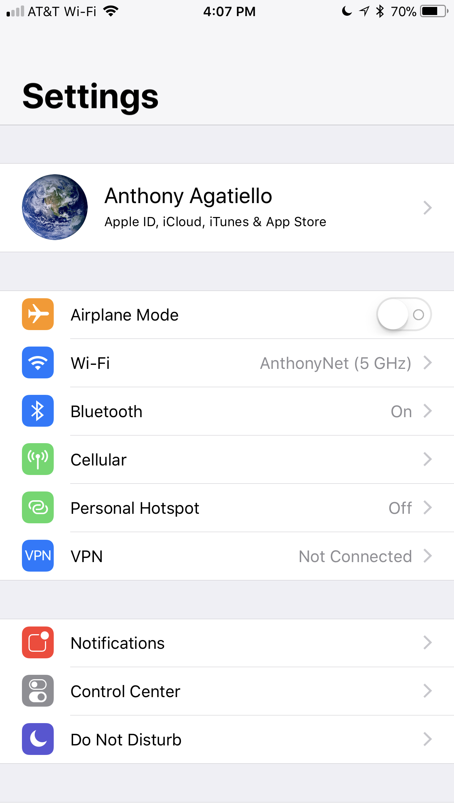
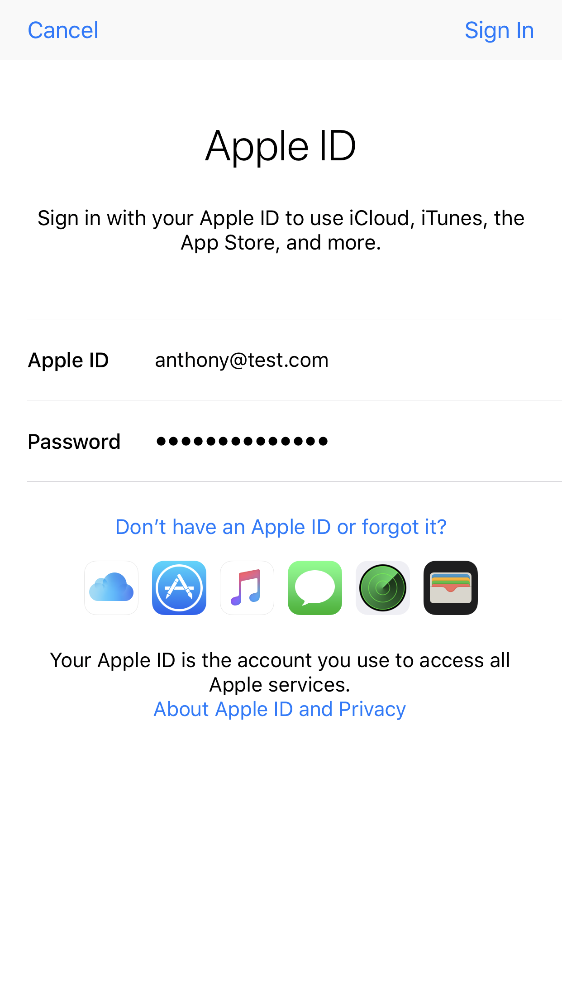
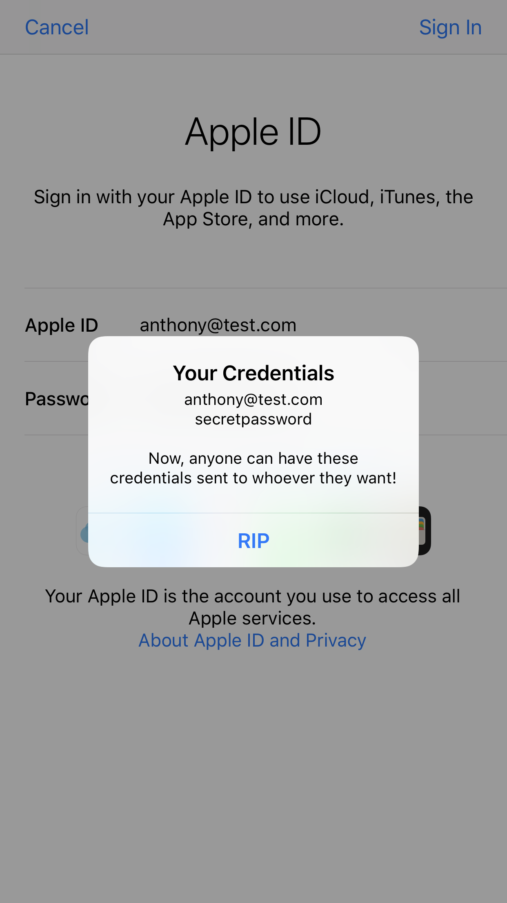

# Phishing the full Apple ID using the built-in iCloud login dialog  
  
I did more research on other possible attack vectors that were available for exploitation to follow up on [@KrauseFx’ blog posts](https://krausefx.com/blog/ios-privacy-stealpassword-easily-get-the-users-apple-id-password-just-by-asking) about how easy it is to fake Apple ID sign-in prompts.  
  
    

## What do the screenshots mean?
In the first screenshot, the user is prompted for their iTunes password, like Felix Krause demonstrated in his [blog post](https://krausefx.com/blog/ios-privacy-stealpassword-easily-get-the-users-apple-id-password-just-by-asking). However, if the user were to click “Cancel” to this prompt in the demo I created, it opens the Settings application, and presents a screen that asks you to enter your credentials for iCloud. This is the **system login screen of iCloud, which is part of the Settings application**. The scary part, is that a developer can run their own code after tapping the “Sign-In” button (as shown in the final screenshot), potentially sending the user’s credentials to someone else.

**Video Demonstration:** https://www.youtube.com/watch?v=zmafn5FVr4M  
**Tweet:** https://twitter.com/AAgatiello/status/922819975743713285

## Disclaimer
This is just a proof of concept, phishing attacks are illegal! Don’t use this in any of your apps. The goal of this blog post is to close the loophole that has been here for many years, and hasn’t been addressed yet. For moral reasons, I have decided not to include the actual source code.

## How does it work?
This sign-in prompt is included within a private framework that is on everyone’s iOS device, and can be easily loaded with *dlopen()* and *objc_getClass()*, avoiding detection of Private APIs by Apple. For reasons that should be obvious, I’m not going to specify the framework name or the class, but this can easily be fixed by Apple; see section below.

## How can you protect yourself?
* Duplicate the radar! [rdar://35150461](https://openradar.appspot.com/radar?id=4965336176656384)
* As always, the best way to protect yourself from phishing is to **enable two-factor authentication**! Even if others have your credentials, they won’t be of much use if you have a second layer of protection.
* As for the alert: double click the home button to bring up multitasking and see which app is currently asking you for your password! Ensure it is not a third-party one.
* You should only be entering your Apple ID information inside of the built-in Settings application, or inside of a pop-up that is not shown within other apps.
* Apps can be modified and injected with more code than originally published with at a later time by someone with malicious intentions. **Never** immediately trust services that are redistributing applications online via enterprise distribution.

## How can Apple fix this problem?
* Apple can easily fix this problem by simply not including this login screen within a framework any developer has access to! It really should not be there to begin with.
* Even if this specific problem does get fixed, alerts could still be used in malicious ways. There needs to be less ambiguity between system alerts and alerts that are generated from developers’ applications; they are virtually indistinguishable from each other.
* **Side note:** if Apple is for some reason reading this, don’t remove dlopen()! The functions in this write-up can be used for good, and they should be used that way. Just please, remove your internal view controllers from your frameworks, or require entitlements to show them.

[Follow me on Twitter](https://twitter.com/AAgatiello) for updates about this and more things related to iOS security.  
[Follow Felix Krause on Twitter](https://twitter.com/KrauseFX) as well; and thanks for the help in writing this post!
